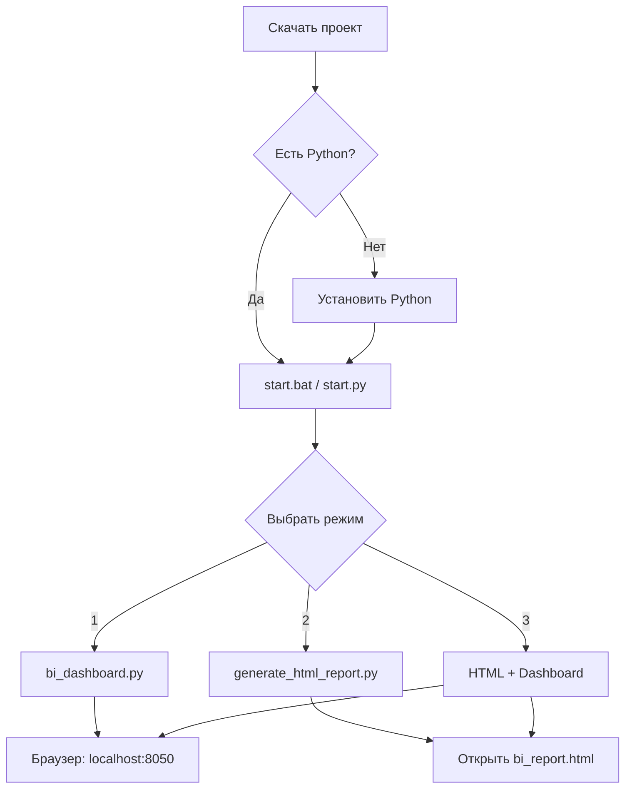

# 📁 Описание файлов проекта BI Dashboard

## 🎯 Исполняемые файлы (для запуска)

### 1. `start.bat` (5.6 KB) ⭐ РЕКОМЕНДУЕТСЯ для Windows
**Назначение:** Главный менеджер запуска с интерактивным меню
**Как использовать:** Дважды кликните на файл
**Функции:**
- Проверка и установка зависимостей
- Запуск интерактивного дашборда
- Генерация HTML отчета
- Выбор режима работы через меню

**Меню:**
```
1. Интерактивный дашборд
2. Статический HTML отчет
3. Оба варианта
4. Установить/Обновить зависимости
0. Выход
```

---

### 2. `start.py` (8.2 KB)
**Назначение:** Универсальный менеджер для всех ОС (Python)
**Как использовать:** `python start.py`
**Функции:**
- Кроссплатформенный (Windows, macOS, Linux)
- Автоматическая проверка и установка зависимостей
- Поиск файла data.xlsx в нескольких местах
- Интерактивное меню выбора режима

---

### 3. `bi_dashboard.py` (20 KB) ⭐ ОСНОВНОЙ ДАШБОРД
**Назначение:** Главный интерактивный веб-дашборд
**Как использовать:** `python bi_dashboard.py`
**Порт:** http://localhost:8050

**Что включает:**
- 4 KPI карточки (Продажи, Доход, Затраты)
- 7 интерактивных графиков
- Адаптивный дизайн
- Автоматическая загрузка данных

**Графики:**
1. План/Факт продаж по месяцам
2. Динамика выполнения плана
3. Доходы, затраты и рентабельность
4. Разбивка затрат по типам
5. ТОП-15 торговых сетей
6. ТОП-15 продуктов
7. Распределение по группам сбыта

**Технологии:**
- Dash (веб-фреймворк)
- Plotly (графики)
- Bootstrap (стили)

---

### 4. `generate_html_report.py` (19 KB)
**Назначение:** Генератор статического HTML отчета
**Как использовать:** `python generate_html_report.py`
**Результат:** Создает файл `bi_report.html` (~69 KB)

**Преимущества:**
- Не требует запуска сервера
- Можно открыть в любое время
- Легко отправить по email
- Графики остаются интерактивными

**Что включает:**
- Те же графики, что и в дашборде
- Красивый дизайн с градиентами
- KPI карточки вверху
- Адаптивная верстка

---

### 5. `run_dashboard.py` (4.7 KB)
**Назначение:** Простой лаунчер для запуска дашборда
**Как использовать:** `python run_dashboard.py`
**Функции:**
- Проверка зависимостей
- Автоматическая установка недостающих пакетов
- Поиск файла data.xlsx
- Запуск bi_dashboard.py

---

### 6. `run_dashboard.bat` (2.5 KB)
**Назначение:** Windows лаунчер для быстрого запуска дашборда
**Как использовать:** Дважды кликните на файл
**Функции:**
- Проверка Python
- Установка библиотек
- Настройка пути к data.xlsx
- Запуск дашборда

---

## 📖 Документация

### 7. `README.md` (15 KB) ⭐ ГЛАВНАЯ ДОКУМЕНТАЦИЯ
**Назначение:** Полная документация проекта
**Разделы:**
- Возможности системы
- Быстрый старт
- Настройка пути к данным
- Технические требования
- Кастомизация
- Решение проблем
- Примеры использования
- Обновление данных

---

### 8. `README_BI.md` (7.2 KB)
**Назначение:** Детальная техническая документация
**Разделы:**
- Описание функционала
- Структура данных
- Инструкции по запуску
- Для вашего пути к файлу
- Устранение проблем

---

### 9. `QUICK_START.txt` (7.7 KB) ⭐ КРАТКАЯ ИНСТРУКЦИЯ
**Назначение:** Быстрая инструкция по запуску
**Формат:** Простой текстовый файл
**Разделы:**
- Что это такое
- 3 шага для запуска
- Настройка пути к файлу
- Что показывает дашборд
- Решение проблем
- Советы

---

### 10. `SUMMARY.md` (12 KB)
**Назначение:** Сводная информация о проекте
**Разделы:**
- Что было создано
- Структура проекта
- Быстрый старт
- Анализ данных (с цифрами)
- ТОП-10 сетей и продуктов
- Технические детали
- Бизнес-инсайты
- Рекомендации

---

### 11. `INSTALLATION.md` (этот файл)
**Назначение:** Пошаговая инструкция по установке
**Разделы:**
- Скачивание файлов
- Подготовка данных
- Установка Python
- Установка библиотек
- Запуск дашборда
- Решение проблем
- Полезные команды

---

### 12. `FILES.md` (этот файл)
**Назначение:** Описание всех файлов проекта

---

## 📊 Файлы данных

### 13. `data.xlsx` (НЕ ВКЛЮЧЕН в репозиторий)
**Назначение:** Исходные данные для анализа
**Расположение:** 
```
\\FS\Users\Private\GFD\Public\Трейд-маркетинг\7.Общие документы\Гусев\итог\data.xlsx
```
**Размер:** ~5-10 MB
**Записей:** 43,899
**Столбцов:** 32
**Период:** 2023-2025

**Столбцы:**
- Дата, Контракт, Сеть, группа сбыта, Brand_format
- Плановые/Факт продажи (шт, руб)
- Плановые/Фактические затраты (5 типов)
- Себестоимость, доход (план/факт)

---

### 14. `bi_report.html` (69 KB)
**Назначение:** Сгенерированный статический HTML отчет
**Создается:** Автоматически при запуске `generate_html_report.py`
**Как открыть:** Дважды кликните на файл
**Содержит:**
- Все графики из дашборда
- KPI метрики
- Интерактивные элементы
- Встроенный JavaScript (Plotly)

---

## 🔧 Служебные файлы

### .gitignore (если есть)
**Назначение:** Список файлов, игнорируемых Git
**Содержит:**
```
*.xlsx
*.xls
bi_report.html
__pycache__/
*.pyc
.venv/
venv/
```

---

## 📦 Зависимости

### requirements.txt (рекомендуется создать)
**Назначение:** Список Python зависимостей
**Содержимое:**
```
pandas>=1.3.0
openpyxl>=3.0.0
plotly>=5.0.0
dash>=2.0.0
dash-bootstrap-components>=1.0.0
numpy>=1.20.0
```

**Использование:**
```bash
pip install -r requirements.txt
```

---

## 📂 Рекомендуемая структура папок

```
project/
│
├── 📄 Исполняемые файлы
│   ├── start.bat                    ⭐ Главный менеджер (Windows)
│   ├── start.py                     ⭐ Менеджер (все ОС)
│   ├── bi_dashboard.py              ⭐ Интерактивный дашборд
│   ├── generate_html_report.py      📊 Генератор HTML
│   ├── run_dashboard.py             🚀 Простой лаунчер
│   └── run_dashboard.bat            🪟 Лаунчер (Windows)
│
├── 📖 Документация
│   ├── README.md                    ⭐ Главная документация
│   ├── README_BI.md                 📚 Техническая документация
│   ├── QUICK_START.txt              ⚡ Краткая инструкция
│   ├── SUMMARY.md                   📋 Сводная информация
│   ├── INSTALLATION.md              🔧 Инструкция по установке
│   └── FILES.md                     📁 Этот файл
│
├── 📊 Данные (не в репозитории)
│   ├── data.xlsx                    📈 Исходные данные
│   └── bi_report.html               🌐 Сгенерированный отчет
│
└── 🔧 Служебные файлы
    ├── .gitignore                   🚫 Игнорируемые файлы
    ├── requirements.txt             📦 Зависимости
    └── LICENSE                      📜 Лицензия
```

---

## 🎯 Какой файл использовать?

### Для первого запуска:
- **Windows:** `start.bat` (двойной клик)
- **Другие ОС:** `start.py`

### Для быстрого запуска дашборда:
- **Windows:** `run_dashboard.bat`
- **Командная строка:** `python bi_dashboard.py`

### Для создания HTML отчета:
- `python generate_html_report.py`

### Для чтения документации:
1. `QUICK_START.txt` - краткая инструкция
2. `README.md` - полная документация
3. `INSTALLATION.md` - установка и настройка
4. `SUMMARY.md` - анализ данных и инсайты

---

## 📊 Размеры файлов

| Файл | Размер | Тип |
|------|--------|-----|
| bi_dashboard.py | 20 KB | Python |
| generate_html_report.py | 19 KB | Python |
| README.md | 15 KB | Markdown |
| SUMMARY.md | 12 KB | Markdown |
| start.py | 8.2 KB | Python |
| QUICK_START.txt | 7.7 KB | Text |
| README_BI.md | 7.2 KB | Markdown |
| start.bat | 5.6 KB | Batch |
| run_dashboard.py | 4.7 KB | Python |
| run_dashboard.bat | 2.5 KB | Batch |
| bi_report.html | 69 KB | HTML |
| **ВСЕГО** | **~150 KB** | - |

---

## 🔄 Порядок использования файлов



---

## ✨ Советы

### Для новичков:
1. Начните с `QUICK_START.txt`
2. Используйте `start.bat` (Windows)
3. Выберите "Установить зависимости" в меню
4. Затем выберите "Оба варианта"

### Для опытных пользователей:
1. Установите зависимости: `pip install -r requirements.txt`
2. Запустите напрямую: `python bi_dashboard.py`
3. Кастомизируйте код под свои нужды

### Для отправки коллегам:
1. Сгенерируйте HTML отчет
2. Отправьте файл `bi_report.html` по email
3. Коллеги просто откроют его в браузере

---

## 📞 Поддержка

Если у вас возникли вопросы о файлах:

1. Откройте `README.md` для общей информации
2. Откройте `INSTALLATION.md` для помощи с установкой
3. Откройте `SUMMARY.md` для анализа данных
4. Создайте Issue на GitHub

---

**Все файлы созданы и готовы к использованию! 🎉**

*Обновлено: Декабрь 2025*
